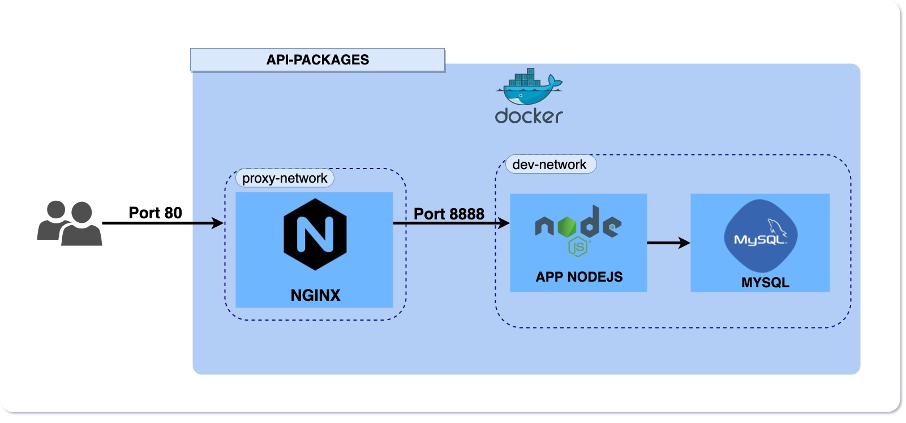

#  Desafio Delta

O projeto consiste em uma API implementada com Node.js​ + MySQL​ para criação e consulta de pacotes

##Diagrama - Infraestrutura
<p align="center">
  
</p>

##Pré-requisitos:
* Ter o git instalado
* Ter docker instalado
* Ter docker-compose instalado

##Executar 

- Clone o repositório do projeto
```
$ git clone https://github.com/luumarodrigues/challenge-delta.git
```

- Execute o script start.sh para fazer deploy da aplicação

```
$ sh start.sh
```
- Após o deploy, escolha entre as opções para criar, listar ou deletar os pacotes.


